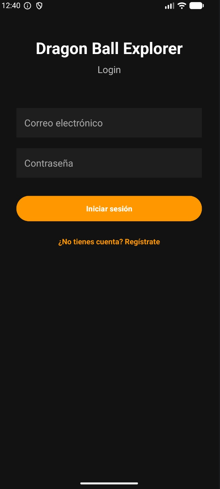
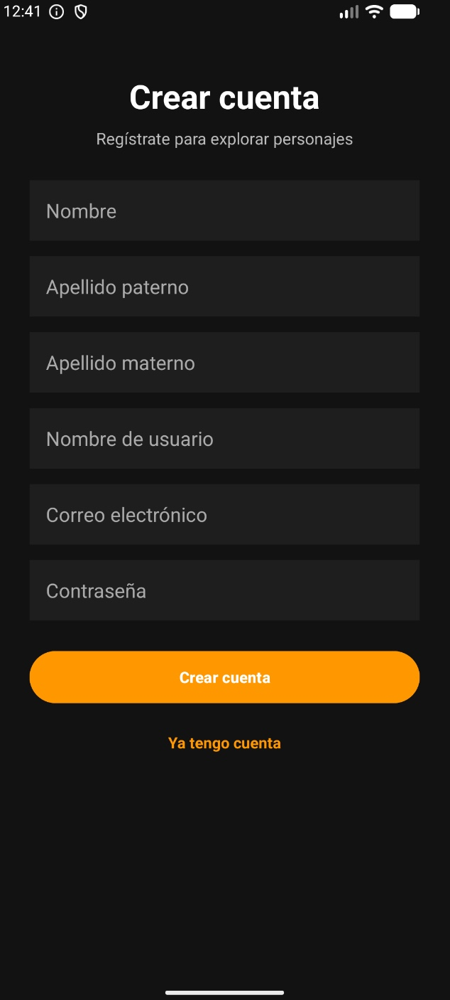
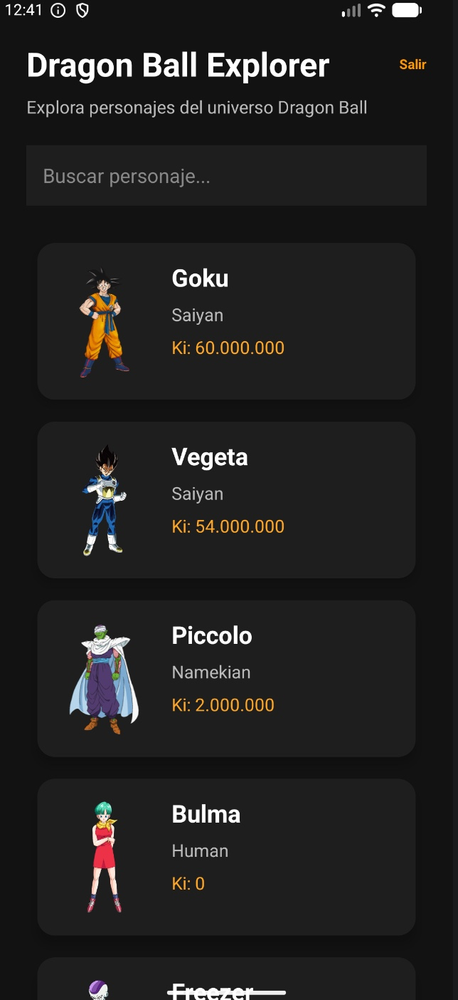
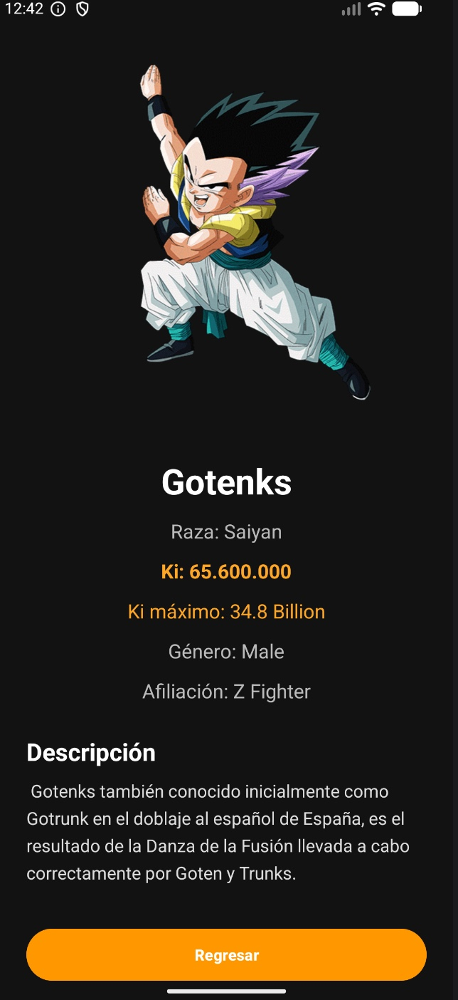

#  Dragon Ball Explorer

Aplicación Android desarrollada en Kotlin que consume la Dragon Ball API para explorar personajes del universo Dragon Ball.

##  Características

-  Inicio de sesión con Firebase Authentication

-  Registro de usuarios con Firebase

-  Cierre de sesión

-  Consumo de API REST con Retrofit

-  Búsqueda dinámica de personajes

-  Lista de personajes mediante RecyclerView

-  Carga de imágenes con Glide

-  Pantalla de detalle para cada personaje

-  Interfaz moderna utilizando XML

---

##  Screenshots

### Login



### Registro



### Lista de Personajes



### Detalle del Personaje



---

##  Arquitectura del Proyecto

```text

app

├── adapters

│   └── CharacterAdapter

│

├── models

│   ├── Character

│   └── CharacterResponse

│

├── network

│   ├── ApiService

│   └── RetrofitInstance

│

├── LoginActivity

├── RegisterActivity

├── MainActivity

└── CharacterDetailActivity

```

---

##  Tecnologías Utilizadas

- Kotlin

- Android Studio

- Firebase Authentication

- Retrofit

- Glide

- RecyclerView

- ConstraintLayout

- XML Layouts

- Git & GitHub

---

##  API Utilizada

Dragon Ball API

```text

https://dragonball-api.com

```

---

##  Funcionalidades Implementadas

### Autenticación

- Registro de usuarios

- Inicio de sesión

- Validación de credenciales

- Persistencia de sesión mediante Firebase

### Consumo de API

- Obtención de personajes desde Dragon Ball API

- Manejo de respuestas JSON

- Comunicación HTTP mediante Retrofit

### Gestión de Personajes

- Visualización de personajes

- Búsqueda en tiempo real

- Pantalla de detalle

- Visualización de:

  - Nombre

  - Raza

  - Ki

  - Imagen

---

##  Conceptos Aplicados

Durante este proyecto se utilizaron:

- Programación Orientada a Objetos

- Consumo de APIs REST

- Manejo de JSON

- RecyclerView y Adapters

- Navegación entre Activities

- Firebase Authentication

- Arquitectura básica por capas

- Git Flow básico

- Control de versiones con GitHub

---

##  Objetivo Académico

Proyecto desarrollado para la materia de Programación Móvil 1 de la carrera Ingeniería en Computación en la UNAM.

El objetivo fue desarrollar una aplicación Android nativa utilizando Kotlin, XML, Firebase y consumo de APIs externas.

---

##  Autor

**Diego Serrano García**

Ingeniería en Computación  

Universidad Nacional Autónoma de México (UNAM)

GitHub:

```text

https://github.com/devserrano

```

---

##  Mejoras Futuras

- Favoritos de personajes

- Persistencia local con Room Database

- Paginación de resultados

- Filtros avanzados

- Modo offline

- Jetpack Navigation

- MVVM Architecture
